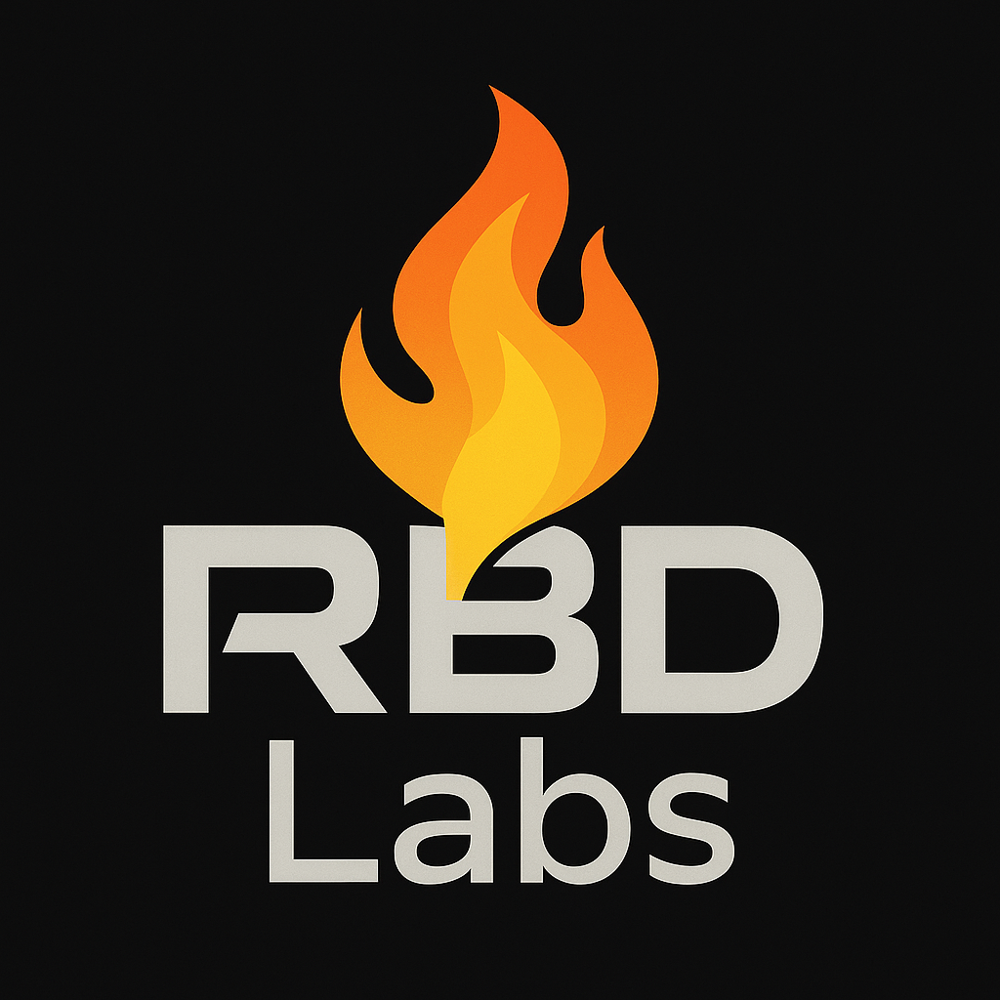

# RBDLabs Audit Portfolio

Welcome to **RBDLabs**, a blockchain security auditing firm specializing in Solidity smart contract audits. Founded by Andry Narson, RBDLabs delivers rigorous security analyses to ensure the integrity, safety, and financial correctness of decentralized protocols. This repository serves as a portfolio showcasing our audit reports and expertise in identifying critical vulnerabilities.

## Audit Portfolio
This repository contains anonymized audit reports for Solidity-based protocols, demonstrating our expertise in smart contract security. Below is a summary of our featured report, with more to be added as we expand our portfolio.

### Completed Audits
- **TSwap Protocol Audit (2025)**: Audit of an Ethereum-based protocol.  
  - Report: [Reports/2025-05-07-tswap-audit-report.pdf](Reports/2025-05-07-tswap-audit-report.pdf)
- **ThunderLoan Protocol Audit (2025)**: Audit of an Ethereum-based protocol.  
  - Report: [Reports/2025-05-13-thunderloan-audit-reports.pdf](Reports/2025-05-13-thunderloan-audit-reports.pdf)
- **Boss bridge Protocol Audit (2025)**: Audit of an Ethereum-based protocol.
  - Report: [Reports/2025-05-19-boss-bridge-audit-report.pdf](Reports/2025-05-19-boss-bridge-audit-report.pdf)

*Note*: All reports are anonymized to protect client confidentiality. Additional reports will be added to the `/reports` directory as completed.

## Expertise
- **Solidity Smart Contract Auditing**: Deep expertise in Ethereum smart contracts, including ERC-20, ERC-721, and DeFi protocols.

## Get in Touch
For auditing services or inquiries, contact Andry Narson, founder of RBDLabs:
- **GitHub**: [@rbd3](https://github.com/rbd3)
- **LinkedIn**: [Andry Narson](https://linkedin.com/in/andry-rabedesana)

## Contributing
This portfolio is a showcase of RBDLabs’ audit work. For collaboration or to contribute to our open-source tools (coming soon), please reach out via GitHub.

*Disclaimer*: All reports are anonymized to ensure client privacy. Detailed reports are available to clients upon request.